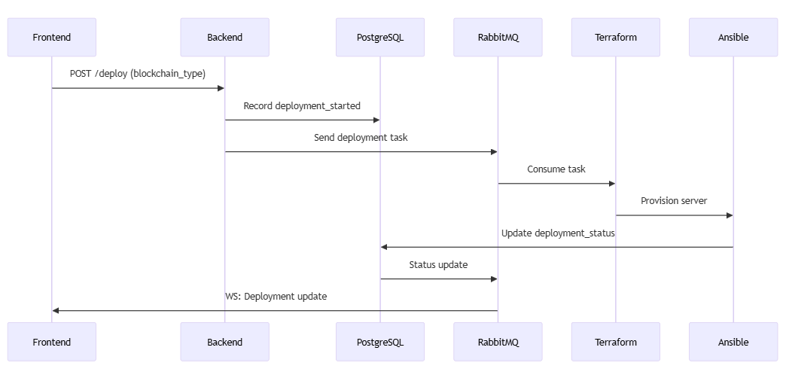

# maron_nodes
This project provides a way to automate the creation of servers on the cloud running validator nodes. This can be done in two ways:

- Through a REST API call to the Backend
- Manual triggering via the Terraform CLI

The backend also provides a way to monitor the status of the servers, logs of the validators, and other useful information that could be useful for an hypotetical frontend, but all of this is optional and not the main focus.

# Rest Api call Workflow Overview 



# Prerequisites

## Backend
- resources/application.properties
- rabbitMQ running
- postgres running

## Infrastructure
- Hetzner Api Key
- Terraform CLI
- Terraform Variables in cloud

### Hetzner Api Key
refer to [Hetzner docs](https://docs.hetzner.cloud/#overview) for instructions on how to create an API key.

### Terraform CLI - Ubuntu
refer to [Terraform docs](https://developer.hashicorp.com/terraform/tutorials/aws-get-started/install-cli) for instructions on installing the CLI.

### Terraform Variables in cloud
You need to create first a terraform workspace. Then you can create these variables in the workspace and refer to it in the terraform code:
- hcloud_token
- hcp_client_id
- hcp_client_secret

### What if i don't want to use HCP cloud?
If you prefer to not use HCP cloud, you can create a terraform.auto.tfvars file in the root directory of each cloud provider with the same variables, for example:
``` infra/terraform/hetzner/terraform.auto.tfvars
hcloud_token = "my-token"
hcp_client_id = "my-client-id"
hcp_client_secret = "my-client-secret"
```

Also you need to remove the "cloud" block on each main.tf:

``` 
  cloud { 
    
    organization = "maronnodes" 

    workspaces { 
      name = "ContaboRuns" 
    } 
  } 
```

### Hetzner Api Key
refer to [Hetzner docs](https://docs.hetzner.cloud/#overview) for instructions on how to create an API key.

# Manually triggering the creation of a node through terraform CLI

### Move to the chosen cloud provider directory
```
cd infra/terraform/<provider>
```

### Login to terraform
```
terraform login
```

### Initialize terraform
 initialize terraform
```
terraform init
```
```
terraform plan
```

# Usage

## Create a new node
... TBD
